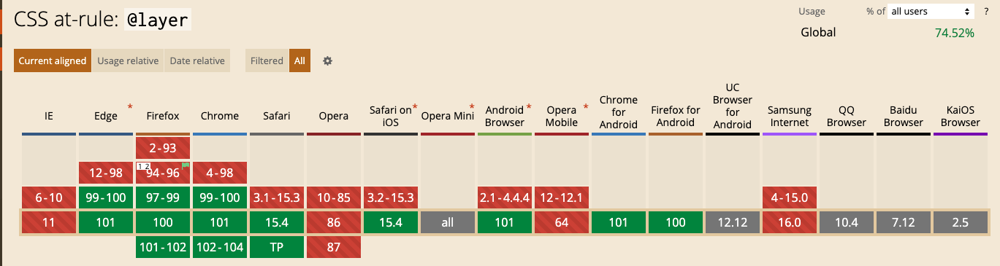

# Before `@layer`

> As styles loaded last can overwrite previously loaded styles.

# What is Cascade Layer?

> Cascade Layers give us more power to manage the "cascading" part of CSS. Currently there are several factors that determine which styles will be applied in your CSS code, including selector specificity and order of appearance.

> Cascade layers allow us to effectively group our CSS into chunks (or "layers")

# @layer

> This is used to declare a cascade layer and can also define the order of precedence in case of multiple cascade layers.

```css
@layer layer-name {rules};
@layer layer-name;
@layer layer-name, layer-name, layer-name;
@layer {rules};
```

> The `@layer` at-rule is to create a named cascade layer with the CSS rules for that layer inside.

```css
@layer utilities {
  .padding-sm {
    padding: 0.5rem;
  }

  .padding-lg {
    padding: 0.8rem;
  }
}
```

> The second way is to create a named cascade layer without assigning any styles. This can be a single layer or multiple layers.

```css
@layer utilities;

@layer theme, layout, utilities;
```

> The last layer to be listed will win if declarations are found in multiple layers.
> A rule in `utilities` would be applied even if it has lower specificity than the rule in `theme`. This is because once the layer order has been established, specificity and order of appearance are ignored.

> The third way is to create a cascade layer with no name, which creates an anonymous cascade layer as a result.

```css
@layer {
  p {
    margin-block: 1rem;
  }
}
```

# example

```css
/* Create the layers, in the desired order */
@layer reset, base, theme;

/* Append the CSS to each of the layers */
@layer reset {
}

@layer base {
  h1.title {
    font-size: 5rem;
  }
}

@layer theme {
  h1 {
    font-size: 3rem;
  }
}
```

# Browser Support




Supports main browsers like Chrome, Edge, Firefox, Safari.
Also Chrome DevTool helps visualizing which styles are coming from which layers.
